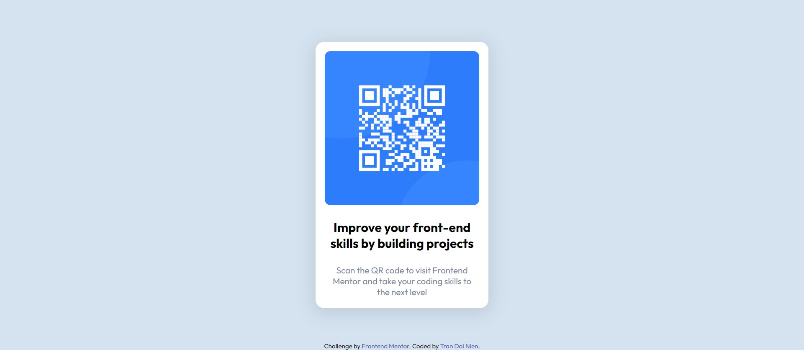

# Frontend Mentor - QR code component solution

This is a solution to the [QR code component challenge on Frontend Mentor](https://www.frontendmentor.io/challenges/qr-code-component-iux_sIO_H). Frontend Mentor challenges help you improve your coding skills by building realistic projects.

## Table of contents

- [Overview](#overview)
  - [Screenshot](#screenshot)
  - [Links](#links)
- [My process](#my-process)
  - [Built with](#built-with)
  - [What I learned](#what-i-learned)
- [Author](#author)
- [Acknowledgments](#acknowledgments)

## Overview

### Screenshot



### Links

- Solution URL: [Add solution URL here](https://github.com/NienDev/qr-code-component.git)
- Live Site URL: [Add live site URL here](https://your-live-site-url.com)

## My process

### Built with

- HTML
- CSS

### What I learned

- Use Semantic Elements and "alt", "aria-hidden" for screen reader purpose

```html
<main></main>
<footer></footer>

```

## Author

- Website - [Tran Dai Nien](https://www.your-site.com)
- Frontend Mentor - [@trandainien](https://www.frontendmentor.io/profile/trandainien)
- Twitter - [@DaiNienn](https://twitter.com/DaiNienn)

## Acknowledgments

Big thank to Frontend Mentor as well as all helpful comments from people around the world
